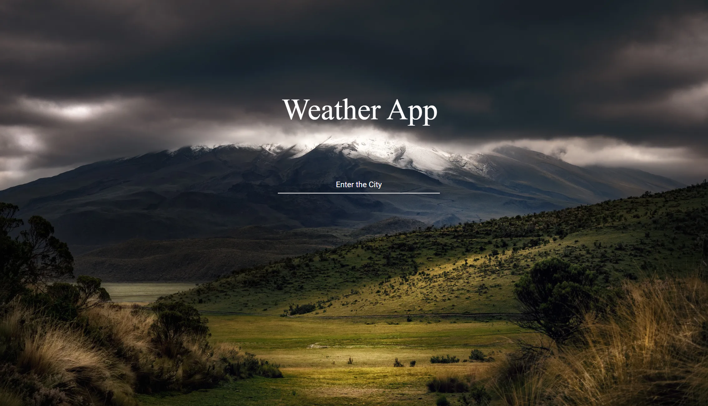
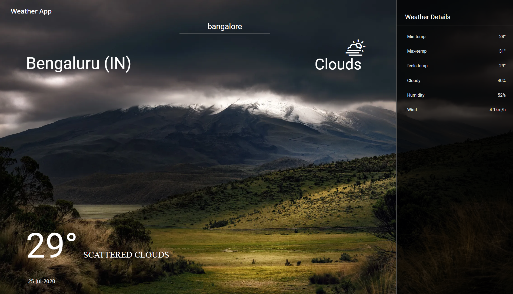

## Setup

```
npm i && npm start
```
## API

https://api.openweathermap.org

## Weather Icons

https://erikflowers.github.io/weather-icons/

## ScreenShots
<p align="center">

</p>


<p align="center">

</p>
